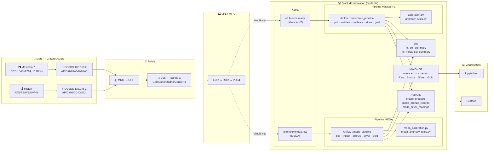
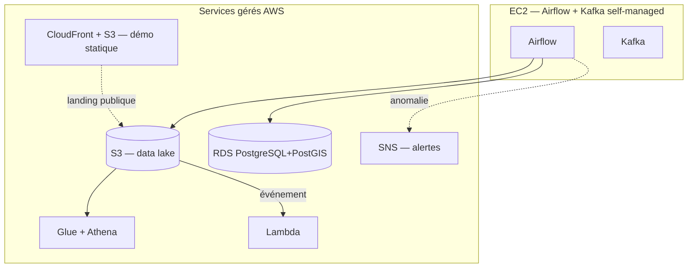
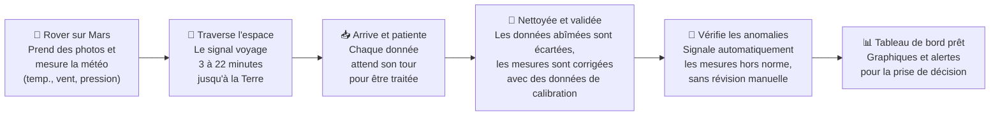

[🇬🇧 English](README.md) · 🇫🇷 **Français** · [🇪🇸 Español](README.es.md)

---

# Mars Rover — Simulation d'ingénierie des données Mastcam-Z

[](.github/workflows/lint.yml)
[](.github/workflows/test.yml)
[](dbt/)
[](infra/aws/)
[](LICENSE)

**Simulation complète du pipeline de données Mastcam-Z de la mission NASA Mars 2020 / Perseverance**, de la capture d'image à la surface de Mars jusqu'aux produits scientifiques calibrés sur Terre — construit comme un projet **Modern Data Stack** : streaming (Kafka), architecture Medallion, orchestration (Airflow), transformation déclarative (dbt), qualité des données, CI/CD, et intégration AWS.

> Ce projet reproduit exactement le flux de données et la méthodologie utilisés par le Jet Propulsion Laboratory (JPL) et le Multi-mission Image Processing Laboratory (MIPL) de la NASA pour traiter les images des caméras stéréo Mastcam-Z à bord du rover Perseverance, dans le cratère Jezero, sur Mars.

📄 **Documentation d'architecture :** [docs/ANALISIS_MODERN_DATA_STACK.md](docs/ANALISIS_MODERN_DATA_STACK.md) (ADR, ES) · [docs/GUIA_IMPLEMENTACION_MODERN_DATA_STACK.md](docs/GUIA_IMPLEMENTACION_MODERN_DATA_STACK.md) (guide pas à pas, Phases 1-6, ES)

---

## Vue d'ensemble de l'architecture



*(Voir la [section Cloud (AWS)](#cloud-aws--stack-moderne-avec-crédit-étudiant) pour la variante de déploiement sur AWS.)*

---

## Résultats — Système en direct

Le diagramme ci-dessus est la promesse ; voici la preuve que le système fonctionne de bout en bout, avec des données générées par le simulateur lui-même, qui traversent Kafka, Airflow, dbt et Postgres jusqu'à un tableau de bord réel.


### Grafana — Télémétrie MEDA et couverture Mastcam-Z


5 panneaux construits sur des données réelles générées par le pipeline, pas des données d'exemple :

- **Courbe diurne de température** (`lmst_h` en abscisse) — reproduit la forme sinusoïdale du modèle physique de MEDA (minimum avant l'aube, maximum après midi solaire martien), pas une ligne d'exemple.
- **Température et pression**, **Vent** — séries temporelles avec un axe droit dédié pour la variable à échelle différente, pour qu'aucune n'écrase l'autre.
- **Couverture d'images par sol** — le ratio 5:3 entre caméra gauche/droite correspond exactement au plan de capture réel du simulateur (RGB stéréo large, zoom rouge, NIR, bleu atmosphérique).
- **Anomalies détectées** — lignes signalées automatiquement par les règles de `meda_anomaly_rules.py` dès qu'une lecture dépasse le seuil configuré, pas un tableau constitué à la main.

### Airflow — Orchestration du pipeline MEDA


Le DAG `meda_full_pipeline` implémente Raw → Bronze (validation) → Silver (calibration + détection d'anomalies) → Gold (agrégats via dbt), en suivant le contrat Medallion de la [constitution du projet](.specify/memory/constitution.md) : chaque couche transforme, aucune n'est sautée.

---

## Spécifications de la caméra Mastcam-Z

| Paramètre | Valeur |
|-----------|-------|
| Format CCD | 1648 × 1214 pixels |
| Taille de pixel | 7,4 µm × 7,4 µm |
| Profondeur de bits | 12 bits (DN 0–4095) |
| Distance focale | 26–110 mm (zoom 4:1) |
| Champ de vue (large) | 25,6° × 19,2° |
| Champ de vue (télé) | 6,2° × 4,6° |
| Positions de filtre | 8 par caméra (16 au total) |
| Plage spectrale | 400–1012 nm |
| Base stéréo | 24,3 cm (gauche à droite) |
| Compression | ICER (avec perte) / sans perte |
| APID gauche | 0x01A5 |
| APID droite | 0x01A6 |

### Configuration de la roue à filtres

| Position | Caméra gauche | λ (nm) | Caméra droite | λ (nm) |
|----------|-------------|--------|--------------|--------|
| 0 | L0 RGB large bande | 530 | R0 RGB large bande | 530 |
| 1 | L1 Bleu | 445 | R1 NIR-480 | 480 |
| 2 | L2 Vert | 527 | R2 Vert | 530 |
| 3 | L3 Rouge | 676 | R3 Rouge | 630 |
| 4 | L4 NIR-800 | 800 | R4 NIR-800 | 800 |
| 5 | L5 NIR-866 | 866 | R5 NIR-908 | 908 |
| 6 | L6 NIR-910 | 910 | R6 NIR-937 | 937 |
| 7 | L7 NIR-939 | 939 | R7 SWIR-1012 | 1012 |

*Référence : Bell et al. 2021, Space Science Reviews 217:24*

---

## Stack technologique

| Composant | Technologie | Objectif |
|-----------|-----------|---------|
| Simulateur de rover | Python 3.11 + NumPy + Pillow | Génération d'images et métadonnées Mastcam-Z |
| Encodeur CCSDS | Python (sur mesure) | Protocole de paquets spatiaux CCSDS 133.0-B-2 |
| Télémétrie | Python + modèle MEDA | Température, pression, vent, opacité de poussière τ |
| Messagerie | Apache Kafka 7.6 | Canal CCSDS + simulation du délai de lumière |
| Data lake | MinIO (compatible S3) / Amazon S3 | Couches Bronze / Silver / Gold, local ou AWS |
| Orchestration ETL | Apache Airflow 2.9 | DAG du pipeline Medallion (10 tâches, dbt inclus) |
| Transformation déclarative | dbt-core 1.8 (Postgres) | Staging + marts, tests, docs/lineage |
| Base de données spatiale | PostgreSQL 16 + PostGIS 3.4 (local ou Amazon RDS) | Empreintes d'images + trajet du rover |
| Supervision | Grafana 10 | Tableaux de bord de séries temporelles de télémétrie |
| Analyse | JupyterHub + SciPy | Notebooks + modèles ML |
| Infrastructure | Docker Compose | Déploiement local complet |
| CI/CD | GitHub Actions | Lint, tests, build dbt, build docker |
| Cloud / IaC | AWS (S3, RDS, EC2, Lambda, Glue/Athena, SNS, SSM, CloudFront) + Terraform | Voir [section Cloud (AWS)](#cloud-aws--stack-moderne-avec-crédit-étudiant) |

---

## Structure du projet

```
rover_mars/
├── docker-compose.yml           # Stack locale complète
├── docker-compose.aws.yml       # Variante EC2 + RDS + S3 (Option C)
├── .env.example                 # Modèle de variables d'environnement
├── Makefile                     # make up / test / dbt-run / tf-plan ...
├── common/rovermars_common/     # Code partagé (client S3/MinIO unique, voir Phase 7)
│   └── storage.py
├── simulator/
│   ├── mastcamz_simulator.py    # Générateur de caméra + étiquettes PDS4
│   ├── telemetry_generator.py   # Modèle d'environnement type MEDA
│   ├── ccsds_encoder.py         # Protocole CCSDS 133.0-B-2
│   └── Dockerfile               # Contexte de build = racine du dépôt (utilise common/)
├── ingestion/
│   ├── dsn_receiver.py          # Kafka → couche Bronze (simulation DSN)
│   └── Dockerfile               # Contexte de build = racine du dépôt (utilise common/)
├── airflow/
│   ├── dags/mastcamz_pipeline.py# DAG ETL complet (Bronze→Silver→Gold + dbt_build)
│   ├── plugins/calibration.py   # Calculs de calibration (testés séparément)
│   ├── plugins/anomaly_rules.py # Règles d'anomalie (testées séparément, Phase 7)
│   ├── plugins/kafka_offsets.py # Suivi des offsets Kafka (testé, Phase 7)
│   └── Dockerfile               # Image Airflow + dbt-core + drivers (utilise common/)
├── dbt/                         # Transformation déclarative (ADR-001)
│   ├── models/staging/
│   ├── models/marts/
│   └── seeds/dsn_stations.csv
├── tests/                       # pytest — CCSDS, calibration, télémétrie
├── .github/workflows/           # CI : lint, tests, build dbt, build docker
├── infra/aws/                   # Terraform — S3, RDS, EC2, Lambda, Glue/Athena...
├── database/
│   ├── init.sql                 # Configuration PostgreSQL + PostGIS
│   └── schema.sql               # Tables, vues, fonctions spatiales
├── dashboard/
│   └── index.html               # Tableau de bord d'architecture interactif
├── docs/                        # ADR, guide d'implémentation, drafts/
├── notebooks/
└── data/                        # raw/ bronze/ silver/ gold/ (ignoré par git)
```

---

## Pipeline de données — Architecture Medallion

### Couche RAW (MinIO : `mastcamz-raw`)
- Fichiers binaires `.IMG` (données CCD 12 bits, big-endian)
- Étiquettes XML PDS4 par image
- Immuable — jamais modifié après réception

### Couche BRONZE (MinIO : `mastcamz-bronze`)
- Métadonnées JSON validées et cataloguées
- Intégrité vérifiée par CRC-16/CCITT
- Station DSN horodatée, délai de lumière enregistré
- Indexé dans la table PostgreSQL `image_products`

### Couche SILVER (MinIO : `mastcamz-silver`)
- Calibré radiométriquement :
  - Soustraction du biais (DN − 2047)
  - Correction du courant d'obscurité
  - Champ plat par filtre
  - Conversion DN → I/F
- Calibration géométrique (modèle de caméra CAHVOR)
- Carte de disparité stéréo (base de 24,3 cm)
- Polygone d'empreinte d'image PostGIS

### Couche GOLD (MinIO : `mastcamz-gold`)
- Statistiques agrégées par sol
- Résumé composite multispectral
- Trajet GeoJSON du rover
- Signalements de tempêtes de poussière
- Séries temporelles prêtes pour Grafana

---

## Tâches du DAG Airflow

```
start_pipeline
    └── poll_bronze_queue         (consommateur Kafka, jusqu'à 50 événements)
         └── validate_raw_products (vérification PDS4 + CRC)
              └── radiometric_calibration (Bias/Dark/Flat/IOF)
                   └── geometric_calibration (modèle CAHVOR)
                        └── write_silver_layer (MinIO/S3 silver)
                             ├── update_postgis (upsert de l'empreinte d'image)
                             │        └── dbt_build (staging + marts + tests, voir dbt/)
                             └── anomaly_detection (tempêtes de poussière, alertes)
                                  └── build_gold_aggregates (statistiques par sol)
                                       ├──────────────┐
                                       └── notify_science_team ← dbt_build
                                            └── end_pipeline
```

Les calculs de calibration (radiométrique/géométrique) se trouvent dans [airflow/plugins/calibration.py](airflow/plugins/calibration.py) — fonctions pures, couvertes par [tests/test_calibration.py](tests/test_calibration.py), indépendantes d'Airflow.

---

## Chaîne de communication (simulée)

| Tronçon | Protocole | Débit | Délai |
|-----|----------|-----------|-------|
| Rover → MRO | UHF 437 MHz | ~2 Mbps | fenêtre ~8 min/sol |
| MRO → DSN | Bande X 8,4 GHz | jusqu'à 100 Mbps | 3–22 min (temps de lumière) |
| DSN → JPL | Fibre (TDRS) | 100+ Mbps | secondes |
| Simulation Kafka | TCP local | illimité | délai configurable |

### Stations terrestres DSN simulées
- **Goldstone, Californie** — DSS-14 (70m), liaison principale vers Mars
- **Madrid, Espagne** — DSS-63 (70m)
- **Canberra, Australie** — DSS-43 (70m)

### Paquet spatial CCSDS (CCSDS 133.0-B-2)
```
En-tête primaire (6 octets) :
  VER(3) | TYPE(1) | SHF(1) | APID(11) | SEQ_FLAGS(2) | SEQ_COUNT(14) | DATA_LEN(16)

En-tête secondaire (16 octets, simulation) :
  SCLK(8) | SOL(4) | WAVELENGTH_NM(2) | CRC16(2)
```

---

## Modèle d'environnement martien

Le générateur de télémétrie reproduit les mesures MEDA (Mars Environmental Dynamics Analyzer) :

| Paramètre | Plage | Modèle |
|-----------|-------|-------|
| Température de surface | −120 à +50 °C | Diurne + saisonnier |
| Température de l'air (1m) | −120 à +30 °C | T_surface − 20°C |
| Pression atmosphérique | 600–850 Pa | Cycle saisonnier du CO₂ |
| Vitesse du vent | 0–25 m/s | Gaussien + saisonnier |
| Opacité de poussière τ | 0,3–8,0 | Modèle de probabilité de tempête |
| Indice UV | 0–6 | Ajusté au périhélie |
| Sortie MMRTG | 110 → 95 W | Déclin RTG de 4,8%/an |
| Temps de propagation de la lumière | 3–22 min | Modèle d'orbite synodique |

---

## Démarrage rapide

### Prérequis
- Docker 24+ et Docker Compose v2
- Python 3.11+ (pour le simulateur autonome)
- 8 Go de RAM minimum (16 Go recommandés)

### Déployer tous les services

```bash
# Cloner le dépôt
git clone https://github.com/javiladino/rover_mars
cd rover_mars

# Copier le modèle .env et définir vos propres identifiants (.env est ignoré par git)
cp .env.example .env
# Générer une vraie clé Fernet Airflow et la coller dans .env :
python -c "from cryptography.fernet import Fernet; print(Fernet.generate_key().decode())"

# Lancer tous les services Docker (équivalent à : make up)
docker compose up --build -d

# Suivre le démarrage
docker compose ps
```

Guide complet pas à pas (inclut dbt, tests, CI/CD et déploiement AWS) : [docs/GUIA_IMPLEMENTACION_MODERN_DATA_STACK.md](docs/GUIA_IMPLEMENTACION_MODERN_DATA_STACK.md) (ES)

### Accéder aux services

Identifiants : définis dans votre `.env` (voir `.env.example`), jamais codés en dur dans le dépôt.

| Service | URL | Identifiants |
|---------|-----|-------------|
| Airflow | http://localhost:8080 | `$AIRFLOW_ADMIN_USER` / `$AIRFLOW_ADMIN_PASSWORD` |
| MinIO | http://localhost:9001 | `$MINIO_ACCESS_KEY` / `$MINIO_SECRET_KEY` |
| Grafana | http://localhost:3001 | `$GRAFANA_ADMIN_USER` / `$GRAFANA_ADMIN_PASSWORD` |
| JupyterHub | http://localhost:8888 | jeton : `$JUPYTER_TOKEN` |
| Kafka UI | http://localhost:8085 | — |
| dbt docs | http://localhost:8081 | `make dbt-docs` |
| Dashboard | [dashboard/index.html](dashboard/index.html) | — |

### Lancer le simulateur en autonome

```bash
cd simulator
pip install -r requirements.txt

KAFKA_BOOTSTRAP=localhost:29092 \
MINIO_ENDPOINT=http://localhost:9000 \
SIMULATION_TOTAL_SOLS=20 \
SIMULATION_INTERVAL_SEC=5 \
python mastcamz_simulator.py
```

### Requêtes utiles

```sql
-- Couverture d'images par sol
SELECT * FROM science.sol_filter_coverage;

-- Trajet du rover (GeoJSON)
SELECT sol, ST_AsGeoJSON(rover_location) FROM science.rover_traverse;

-- Événements de tempête de poussière (τ > 2.0)
SELECT * FROM science.dust_storm_events;

-- Série temporelle complète de télémétrie (source Grafana)
SELECT * FROM science.telemetry_timeseries WHERE time > NOW() - INTERVAL '7 days';
```

---

## Format d'identifiant de produit PDS4

```
urn:nasa:pds:mars2020_mastcamz_sci_raw:data_imagedr:M20_MCZL_0001_0000700032_000RZL_N_01
                                                     │    │    │    │          │   │   │
                                                     │    │    │    │          │   │   └─ Version
                                                     │    │    │    │          │   └─── N=Normal
                                                     │    │    │    │          └─────── RZL=Raw Zoom Left
                                                     │    │    │    └────────────────── SCLK (10 chiffres)
                                                     │    │    └─────────────────────── Numéro de sol
                                                     │    └──────────────────────────── MCZL=Gauche / MCZR=Droite
                                                     └───────────────────────────────── Préfixe de mission
```

---

## Modern Data Stack

Au-delà du pipeline d'ingestion/orchestration, le projet intègre les éléments
attendus aujourd'hui d'un poste de Data Engineer, au-delà du simple ETL :

| Élément | Où | Commande |
|---|---|---|
| Transformation déclarative (dbt) | [`dbt/`](dbt/) — staging + marts, tests, seeds | `make dbt-run` / `make dbt-test` |
| Tests unitaires | [`tests/`](tests/) — CCSDS, calibration, télémétrie | `make test` |
| Lint | ruff | `make lint` |
| CI/CD | [`.github/workflows/`](.github/workflows/) | lint, tests, build dbt, build docker à chaque push/PR |
| Infra as Code | [`infra/aws/`](infra/aws/) — Terraform | `make tf-plan` |

Toutes les décisions d'architecture derrière ces éléments sont documentées
sous forme d'ADR dans [docs/ANALISIS_MODERN_DATA_STACK.md](docs/ANALISIS_MODERN_DATA_STACK.md) (ES),
et l'implémentation pas à pas dans
[docs/GUIA_IMPLEMENTACION_MODERN_DATA_STACK.md](docs/GUIA_IMPLEMENTACION_MODERN_DATA_STACK.md) (ES).

---

## Cloud (AWS) — stack moderne avec crédit étudiant

Le stack peut aussi être déployé en combinant du calcul self-managed avec
des services gérés AWS, adoptés sélectivement selon leur coût réel face à
un budget crédit étudiant limité (ADR-011 à ADR-020 dans l'analyse
d'architecture) :



MWAA (Airflow géré) et MSK (Kafka géré) ont été évalués et délibérément
écartés pour des raisons de coût (~300 USD/mois et ~150 USD/mois
respectivement) — le détail de cette décision est dans l'ADR-014. Tout le
déploiement est provisionné avec Terraform dans [`infra/aws/`](infra/aws/README.md)
et documenté pas à pas dans la Phase 4 du guide d'implémentation (ES).

---

## Extensions futures

- **Carte 3D de Mars avec CesiumJS** — Trajet du rover sur un modèle de terrain MOLA
- **Classification de terrain par ML** — Détection basalte/carbonate/olivine à partir du multispectral
- **Modèle de détection d'anomalies** — Isolation Forest sur le flux de capteurs MEDA
- **Installation à la Cité de l'Espace** — Prototype de visualisation en dôme à 360°
- **Intégration ESA ExoMars** — Pipeline de données du spectromètre Raman
- **Ingestion de données PDS4 réelles** — Archive publique ASU/NASA Mastcam-Z

---

## Références

- Bell et al. (2021). *The Mars 2020 Perseverance Rover Mast Camera Zoom (Mastcam-Z) Investigation*. Space Science Reviews 217:24. [DOI 10.1007/s11214-020-00755-x](https://doi.org/10.1007/s11214-020-00755-x)
- Hayes et al. (2021). *Pre-Flight Calibration of Mastcam-Z*. Space Science Reviews 217:40.
- CCSDS (2012). *Space Packet Protocol*. Recommendation CCSDS 133.0-B-2.
- NASA PDS4 Standards Reference. https://pds.nasa.gov/pds4/doc/sr/
- NASA DSN 810-005 Telecommunications Link Design Handbook.
- Mastcam-Z PDS4 Archive (DOI 10.17189/q3ts-c749). https://mastcamz.asu.edu/mastcam-z-data-for-all/

---

## Vous n'êtes pas technique ? (recruteurs / RH)

Ce projet est une réplique fonctionnelle, construite de bout en bout, du
système que la NASA utilise pour recevoir et traiter les photos et les
données environnementales du rover Perseverance sur Mars — pas un exercice
de cours, mais la simulation d'un vrai problème d'ingénierie des données,
construite avec le même niveau d'exigence (tests automatisés, contrôle des
coûts cloud, documentation des décisions) qu'utiliserait une équipe
professionnelle. Une explication de 2 minutes, sans jargon technique, se
trouve dans la [section 10 du guide d'implémentation](docs/GUIA_IMPLEMENTACION_MODERN_DATA_STACK.md#10-explicación-para-perfiles-no-técnicos-cierre-de-la-guía) (en espagnol).

**Que fait le système, en 6 étapes ?**



*(Le diagramme technique complet, avec le nom réel de chaque composant du stack, se trouve dans la [section Vue d'ensemble de l'architecture](#vue-densemble-de-larchitecture).)*

---

## Contact

Javier Ladino · Data Engineer
[javier.ladino.moreno@gmail.com](mailto:javier.ladino.moreno@gmail.com)

> *"Exploring Mars, building from Earth."*
