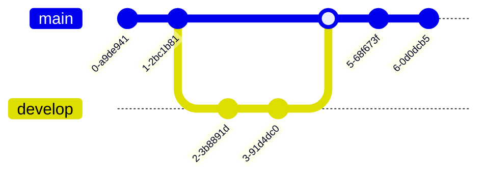

# 🛰️ Proyecto Simulación de Flujo de Datos del Rover en Marte

## 🚀 Descripción

Este proyecto simula el flujo completo de datos que realiza un rover en Marte, como el Curiosity, desde la captura de datos hasta la visualización en dashboards interactivos. El objetivo es educativo y demostrativo, dirigido a estudiantes de ingeniería de datos, startups interesadas en geodatos y reclutadores de agencias espaciales.

La simulación incluye sensores, transmisión simulada, procesamiento ETL, almacenamiento analítico, análisis con modelos de machine learning y visualización.

---

## 🧱 Arquitectura General

```
[Simulación del Rover] -> [Transmisión simulada] -> [ETL Pipeline] -> [Almacenamiento] -> [Modelos ML] -> [Dashboard Web]

```

---

## 🧰 Tecnologías Usadas

| Componente | Herramientas / Tecnologías |
| --- | --- |
| Simulación de sensores | Python, Pandas, OpenCV |
| Transmisión de datos | Kafka (opcional), Python con delay y errores |
| Procesamiento ETL | Apache Airflow, PySpark |
| Almacenamiento | MinIO / S3, PostgreSQL + PostGIS, Parquet |
| ML (opcional) | Scikit-learn, TensorFlow, autoencoders |
| Visualización | React, Tailwind, Plotly, CesiumJS, Recharts |
| Infraestructura | Docker, Docker Compose, GitHub Actions (CI/CD) |

---

## 🧪 Simulación de Datos

- **Telemetría**: Temperatura, batería, presión, coordenadas
- **Imágenes**: Usadas desde la NASA API o dataset estático
- **Errores de transmisión**: Simulados con pérdidas y retrasos

---

## 📦 Estructura del Proyecto

```bash
📁 rover-simulacion/
├── data/                  # Datos simulados y crudos
├── images/                # Imágenes del rover
├── dashboard/             # Frontend en React
├── backend/               # ETL + APIs simuladas
├── notebooks/             # Análisis exploratorio y ML
├── docker-compose.yml     # Infraestructura local
├── airflow/               # DAGs para procesamiento
└── README.md              # Este archivo

```

---

## 🖥️ Cómo ejecutar el proyecto

### Requisitos

- Docker y Docker Compose
- Python 3.10+
- Node.js (para el dashboard)

### Pasos

```bash
# 1. Clonar el repositorio
$ git clone https://github.com/tuusuario/rover-simulacion
$ cd rover-simulacion

# 2. Levantar servicios
$ docker-compose up --build

# 3. Acceder al dashboard
http://localhost:3000

# 4. Entrar a Airflow para ver el pipeline
http://localhost:8080 (usuario: admin, contraseña: admin)

```

---

## 📊 Visualización

- **Dashboard web** con telemetría, ruta del rover y galería de imágenes
- **Gráficos interactivos** con Recharts y mapas con CesiumJS

---

## 🤖 Modelos de ML (opcional)

- Clasificación de terreno
- Predicción de fallos
- Detección de anomalías en sensores

---

## 🎯 Objetivos educativos

- Enseñar a construir pipelines ETL complejos
- Integrar geodatos e imágenes en un solo sistema
- Familiarizarse con tecnologías de datos usadas en exploración espacial

---

## 🤝 Contribuciones y licencias

- Código bajo licencia MIT
- Puedes abrir issues o pull requests

---

## 🌌 Créditos

- NASA Open API
- ESA Planetary Data Archive
- Comunidad de datos abiertos espaciales

---

## 📬 Contacto

Si eres reclutador, educador o agencia interesada, puedes contactarme en [javierladino@me.com](mailto:javierladino@me.com)

---

**¡Explora Marte, construyendo desde la Tierra!**

