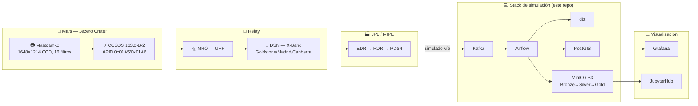
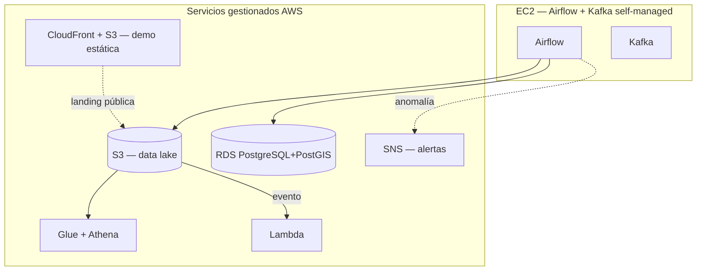

# Mars Rover — Mastcam-Z Data Engineering Simulation

[](.github/workflows/lint.yml)
[](.github/workflows/test.yml)
[](dbt/)
[](infra/aws/)
[](LICENSE)

**Simulation of the complete NASA Mars 2020 / Perseverance Mastcam-Z data pipeline**, from image capture on the Martian surface to calibrated science products on Earth — implementado como un proyecto de **Modern Data Stack**: streaming (Kafka), arquitectura Medallion, orquestación (Airflow), transformación declarativa (dbt), calidad de datos, CI/CD e integración con AWS.

> This project replicates the exact data flow and methodology used by NASA's Jet Propulsion Laboratory (JPL) and the Multi-mission Image Processing Laboratory (MIPL) to process images from the Mastcam-Z stereo cameras aboard the Perseverance rover at Jezero Crater, Mars.

📄 **Documentación de arquitectura:** [docs/ANALISIS_MODERN_DATA_STACK.md](docs/ANALISIS_MODERN_DATA_STACK.md) (ADRs) · [docs/GUIA_IMPLEMENTACION_MODERN_DATA_STACK.md](docs/GUIA_IMPLEMENTACION_MODERN_DATA_STACK.md) (guía paso a paso, Fases 1-6)

---

## Architecture Overview


```mermaid
flowchart LR
    subgraph MARS["🔴 Mars — Jezero Crater"]
        CAM["📷 Mastcam-Z<br/>1648×1214 CCD, 16 filtros"]
        FPGA["⚡ CCSDS 133.0-B-2<br/>APID 0x01A5/0x01A6"]
        CAM --> FPGA
    end
    subgraph RELAY["🚀 Relay"]
        MRO["🛸 MRO — UHF"]
        DSN["📡 DSN — X-Band<br/>Goldstone/Madrid/Canberra"]
        MRO --> DSN
    end
    subgraph GROUND["🏭 JPL / MIPL"]
        EDR["EDR → RDR → PDS4"]
    end
    subgraph SIM["💻 Stack de simulación (este repo)"]
        KAFKA["Kafka"]
        AIRFLOW["Airflow"]
        DBT["dbt"]
        LAKE["MinIO / S3<br/>Bronze→Silver→Gold"]
        PG["PostGIS"]
        KAFKA --> AIRFLOW --> DBT
        AIRFLOW --> LAKE
        AIRFLOW --> PG
    end
    subgraph VIZ["📊 Visualización"]
        GRAFANA["Grafana"]
        JUPYTER["JupyterHub"]
    end
    FPGA --> MRO
    DSN --> EDR
    EDR -.simulado vía.-> KAFKA
    PG --> GRAFANA
    LAKE --> JUPYTER
```

*(Ver [sección Cloud (AWS)](#cloud-aws--stack-moderno-con-crédito-de-estudiante) para la variante de despliegue en AWS.)*

---

## Mastcam-Z Camera Specifications

| Parameter | Value |
|-----------|-------|
| CCD format | 1648 × 1214 pixels |
| Pixel size | 7.4 µm × 7.4 µm |
| Bit depth | 12-bit (DN 0–4095) |
| Focal length | 26–110 mm (4:1 zoom) |
| FOV (wide) | 25.6° × 19.2° |
| FOV (tele) | 6.2° × 4.6° |
| Filter positions | 8 per camera (16 total) |
| Spectral range | 400–1012 nm |
| Stereo baseline | 24.3 cm (Left to Right) |
| Compression | ICER (lossy) / Lossless |
| APID Left | 0x01A5 |
| APID Right | 0x01A6 |

### Filter Wheel Configuration

| Position | Left Camera | λ (nm) | Right Camera | λ (nm) |
|----------|-------------|--------|--------------|--------|
| 0 | L0 Broadband RGB | 530 | R0 Broadband RGB | 530 |
| 1 | L1 Blue | 445 | R1 NIR-480 | 480 |
| 2 | L2 Green | 527 | R2 Green | 530 |
| 3 | L3 Red | 676 | R3 Red | 630 |
| 4 | L4 NIR-800 | 800 | R4 NIR-800 | 800 |
| 5 | L5 NIR-866 | 866 | R5 NIR-908 | 908 |
| 6 | L6 NIR-910 | 910 | R6 NIR-937 | 937 |
| 7 | L7 NIR-939 | 939 | R7 SWIR-1012 | 1012 |

*Reference: Bell et al. 2021, Space Science Reviews 217:24*

---

## Technology Stack

| Component | Technology | Purpose |
|-----------|-----------|---------|
| Rover simulator | Python 3.11 + NumPy + Pillow | Mastcam-Z image + metadata generation |
| CCSDS encoder | Python (custom) | CCSDS 133.0-B-2 space packet protocol |
| Telemetry | Python + MEDA model | Temperature, pressure, wind, dust τ |
| Messaging | Apache Kafka 7.6 | CCSDS channel + light-delay simulation |
| Data lake | MinIO (S3-compatible) / Amazon S3 | Bronze / Silver / Gold layers, local o AWS |
| ETL orchestration | Apache Airflow 2.9 | Medallion pipeline DAG (10 tasks, incl. dbt) |
| Transformación declarativa | dbt-core 1.8 (Postgres) | Staging + marts, tests, docs/lineage |
| Spatial database | PostgreSQL 16 + PostGIS 3.4 (local o Amazon RDS) | Image footprints + rover traverse |
| Monitoring | Grafana 10 | Telemetry time-series dashboards |
| Analysis | JupyterHub + SciPy | Notebooks + ML models |
| Infrastructure | Docker Compose | Full local deployment |
| CI/CD | GitHub Actions | Lint, tests, dbt build, docker build |
| Cloud / IaC | AWS (S3, RDS, EC2, Lambda, Glue/Athena, SNS, SSM, CloudFront) + Terraform | Ver [sección Cloud (AWS)](#cloud-aws--stack-moderno-con-crédito-de-estudiante) |

---

## Project Structure

```
rover_mars/
├── docker-compose.yml           # Stack local completo
├── docker-compose.aws.yml       # Variante EC2 + RDS + S3 (Opción C)
├── .env.example                 # Plantilla de variables de entorno
├── Makefile                     # make up / test / dbt-run / tf-plan ...
├── common/rovermars_common/     # Código compartido (cliente S3/MinIO único, ver Fase 7)
│   └── storage.py
├── simulator/
│   ├── mastcamz_simulator.py    # Camera + PDS4 label generator
│   ├── telemetry_generator.py   # MEDA-like environment model
│   ├── ccsds_encoder.py         # CCSDS 133.0-B-2 protocol
│   └── Dockerfile               # Build context = raíz del repo (usa common/)
├── ingestion/
│   ├── dsn_receiver.py          # Kafka → Bronze layer (DSN simulation)
│   └── Dockerfile               # Build context = raíz del repo (usa common/)
├── airflow/
│   ├── dags/mastcamz_pipeline.py# Full ETL DAG (Bronze→Silver→Gold + dbt_build)
│   ├── plugins/calibration.py   # Matemática de calibración (testeada aparte)
│   ├── plugins/anomaly_rules.py # Reglas de anomalía (testeadas aparte, Fase 7)
│   ├── plugins/kafka_offsets.py # Bookkeeping de offsets Kafka (testeado, Fase 7)
│   └── Dockerfile               # Imagen Airflow + dbt-core + drivers (usa common/)
├── dbt/                         # Transformación declarativa (ADR-001)
│   ├── models/staging/
│   ├── models/marts/
│   └── seeds/dsn_stations.csv
├── tests/                       # pytest — CCSDS, calibración, telemetría
├── .github/workflows/           # CI: lint, tests, dbt build, docker build
├── infra/aws/                   # Terraform — S3, RDS, EC2, Lambda, Glue/Athena...
├── database/
│   ├── init.sql                 # PostgreSQL + PostGIS setup
│   └── schema.sql               # Tables, views, spatial functions
├── dashboard/
│   └── index.html               # Interactive architecture dashboard
├── docs/                        # ADRs, guía de implementación, drafts/
├── notebooks/
└── data/                        # raw/ bronze/ silver/ gold/ (gitignored)
```

---

## Data Pipeline — Medallion Architecture

### RAW Layer (MinIO: `mastcamz-raw`)
- Binary `.IMG` files (12-bit CCD data, big-endian)
- PDS4 XML labels per image
- Immutable — never modified after arrival

### BRONZE Layer (MinIO: `mastcamz-bronze`)
- Validated and catalogued JSON metadata
- CRC-16/CCITT integrity verified
- DSN station stamped, light-delay recorded
- Indexed in PostgreSQL `image_products` table

### SILVER Layer (MinIO: `mastcamz-silver`)
- Radiometrically calibrated:
  - Bias subtraction (DN − 2047)
  - Dark current correction
  - Flat-field per filter
  - DN → I/F conversion
- Geometric calibration (CAHVOR camera model)
- Stereo disparity map (24.3 cm baseline)
- PostGIS image footprint polygon

### GOLD Layer (MinIO: `mastcamz-gold`)
- Sol-level aggregate statistics
- Multispectral composite summary
- Rover traverse GeoJSON path
- Dust storm event flags
- Grafana-ready time-series

---

## Airflow DAG Tasks

```
start_pipeline
    └── poll_bronze_queue         (Kafka consumer, up to 50 events)
         └── validate_raw_products (PDS4 + CRC check)
              └── radiometric_calibration (Bias/Dark/Flat/IOF)
                   └── geometric_calibration (CAHVOR model)
                        └── write_silver_layer (MinIO/S3 silver)
                             ├── update_postgis (image footprint upsert)
                             │        └── dbt_build (staging + marts + tests, ver dbt/)
                             └── anomaly_detection (dust storms, alerts)
                                  └── build_gold_aggregates (sol stats)
                                       ├──────────────┐
                                       └── notify_science_team ← dbt_build
                                            └── end_pipeline
```

La matemática de calibración (radiometric/geometric) vive en [airflow/plugins/calibration.py](airflow/plugins/calibration.py) — funciones puras, cubiertas por [tests/test_calibration.py](tests/test_calibration.py), independientes de Airflow.

---

## Communication Chain (Simulated)

| Leg | Protocol | Data Rate | Delay |
|-----|----------|-----------|-------|
| Rover → MRO | UHF 437 MHz | ~2 Mbps | ~8 min/sol window |
| MRO → DSN | X-Band 8.4 GHz | up to 100 Mbps | 3–22 min (light time) |
| DSN → JPL | Fiber (TDRS) | 100+ Mbps | seconds |
| Kafka simulation | Local TCP | unlimited | configurable delay |

### DSN Ground Stations Simulated
- **Goldstone, California** — DSS-14 (70m), primary Mars link
- **Madrid, Spain** — DSS-63 (70m)
- **Canberra, Australia** — DSS-43 (70m)

### CCSDS Space Packet (CCSDS 133.0-B-2)
```
Primary Header (6 bytes):
  VER(3) | TYPE(1) | SHF(1) | APID(11) | SEQ_FLAGS(2) | SEQ_COUNT(14) | DATA_LEN(16)

Secondary Header (16 bytes, simulation):
  SCLK(8) | SOL(4) | WAVELENGTH_NM(2) | CRC16(2)
```

---

## Mars Environment Model

The telemetry generator replicates MEDA (Mars Environmental Dynamics Analyzer) measurements:

| Parameter | Range | Model |
|-----------|-------|-------|
| Surface temperature | −120 to +50 °C | Diurnal + seasonal |
| Air temperature (1m) | −120 to +30 °C | T_surface − 20°C |
| Atmospheric pressure | 600–850 Pa | Seasonal CO₂ cycle |
| Wind speed | 0–25 m/s | Gaussian + seasonal |
| Dust opacity τ | 0.3–8.0 | Storm probability model |
| UV index | 0–6 | Perihelion-scaled |
| MMRTG output | 110 → 95 W | 4.8%/year RTG decay |
| Light travel time | 3–22 min | Synodic orbit model |

---

## Quick Start

### Prerequisites
- Docker 24+ and Docker Compose v2
- Python 3.11+ (for standalone simulator)
- 8 GB RAM minimum (16 GB recommended)

### Deploy All Services

```bash
# Clone the repository
git clone https://github.com/javiladino/rover_mars
cd rover_mars

# Copy the env template and set your own credentials (.env is gitignored)
cp .env.example .env
# Generate a real Airflow Fernet key and paste it into .env:
python -c "from cryptography.fernet import Fernet; print(Fernet.generate_key().decode())"

# Launch all Docker services (equivalente a: make up)
docker compose up --build -d

# Monitor startup
docker compose ps
```

Guía completa paso a paso (incluye dbt, tests, CI/CD y despliegue en AWS): [docs/GUIA_IMPLEMENTACION_MODERN_DATA_STACK.md](docs/GUIA_IMPLEMENTACION_MODERN_DATA_STACK.md)

### Access Services

Credenciales: definidas en tu `.env` (ver `.env.example`), nunca hardcodeadas en el repo.

| Service | URL | Credentials |
|---------|-----|-------------|
| Airflow | http://localhost:8080 | `$AIRFLOW_ADMIN_USER` / `$AIRFLOW_ADMIN_PASSWORD` |
| MinIO | http://localhost:9001 | `$MINIO_ACCESS_KEY` / `$MINIO_SECRET_KEY` |
| Grafana | http://localhost:3001 | `$GRAFANA_ADMIN_USER` / `$GRAFANA_ADMIN_PASSWORD` |
| JupyterHub | http://localhost:8888 | token: `$JUPYTER_TOKEN` |
| Kafka UI | http://localhost:8085 | — |
| dbt docs | http://localhost:8081 | `make dbt-docs` |
| Dashboard | [dashboard/index.html](dashboard/index.html) | — |

### Run Simulator Standalone

```bash
cd simulator
pip install -r requirements.txt

KAFKA_BOOTSTRAP=localhost:29092 \
MINIO_ENDPOINT=http://localhost:9000 \
SIMULATION_TOTAL_SOLS=20 \
SIMULATION_INTERVAL_SEC=5 \
python mastcamz_simulator.py
```

### Useful Queries

```sql
-- Image coverage per sol
SELECT * FROM science.sol_filter_coverage;

-- Rover traverse path (GeoJSON)
SELECT sol, ST_AsGeoJSON(rover_location) FROM science.rover_traverse;

-- Dust storm events (τ > 2.0)
SELECT * FROM science.dust_storm_events;

-- Full telemetry time-series (Grafana source)
SELECT * FROM science.telemetry_timeseries WHERE time > NOW() - INTERVAL '7 days';
```

---

## PDS4 Product ID Format

```
urn:nasa:pds:mars2020_mastcamz_sci_raw:data_imagedr:M20_MCZL_0001_0000700032_000RZL_N_01
                                                     │    │    │    │          │   │   │
                                                     │    │    │    │          │   │   └─ Version
                                                     │    │    │    │          │   └─── N=Normal
                                                     │    │    │    │          └─────── RZL=Raw Zoom Left
                                                     │    │    │    └────────────────── SCLK (10 digits)
                                                     │    │    └─────────────────────── Sol number
                                                     │    └──────────────────────────── MCZL=Left / MCZR=Right
                                                     └───────────────────────────────── Mission prefix
```

---

## Modern Data Stack

Además del pipeline de ingesta/orquestación, el proyecto incorpora las piezas que
hoy se esperan de un rol de Data Engineer más allá del ETL:

| Pieza | Dónde | Comando |
|---|---|---|
| Transformación declarativa (dbt) | [`dbt/`](dbt/) — staging + marts, tests, seeds | `make dbt-run` / `make dbt-test` |
| Tests unitarios | [`tests/`](tests/) — CCSDS, calibración, telemetría | `make test` |
| Lint | ruff | `make lint` |
| CI/CD | [`.github/workflows/`](.github/workflows/) | lint, tests, dbt build, docker build en cada push/PR |
| Infra as Code | [`infra/aws/`](infra/aws/) — Terraform | `make tf-plan` |

Todas las decisiones de arquitectura detrás de estas piezas están documentadas
como ADRs en [docs/ANALISIS_MODERN_DATA_STACK.md](docs/ANALISIS_MODERN_DATA_STACK.md),
y la implementación paso a paso en [docs/GUIA_IMPLEMENTACION_MODERN_DATA_STACK.md](docs/GUIA_IMPLEMENTACION_MODERN_DATA_STACK.md).

---

## Cloud (AWS) — stack moderno con crédito de estudiante

El stack también puede desplegarse combinando cómputo self-managed con
servicios gestionados de AWS, adoptados selectivamente según su costo real
frente a un crédito de estudiante limitado (ADR-011 a ADR-020 en el
análisis de arquitectura):


```mermaid
flowchart TB
    subgraph EC2["EC2 — Airflow + Kafka self-managed"]
        A[Airflow]
        K[Kafka]
    end
    subgraph AWS["Servicios gestionados AWS"]
        S3[(S3 — data lake)]
        RDS[(RDS PostgreSQL+PostGIS)]
        GLUE[Glue + Athena]
        LAMBDA[Lambda]
        SNS[SNS — alertas]
        CF[CloudFront + S3 — demo estática]
    end
    A --> S3
    A --> RDS
    S3 --> GLUE
    S3 -- evento --> LAMBDA
    A -. anomalía .-> SNS
    CF -. landing pública .-> S3
```

MWAA (Airflow gestionado) y MSK (Kafka gestionado) se evaluaron y se
descartaron deliberadamente por costo (~300 USD/mes y ~150 USD/mes
respectivamente) — el detalle de esa decisión está en ADR-014. Todo el
despliegue está provisionado con Terraform en [`infra/aws/`](infra/aws/README.md)
y documentado paso a paso en la Fase 4 de la guía de implementación.

---

## Future Extensions

- **CesiumJS 3D Mars map** — Rover traverse on MOLA terrain model
- **ML terrain classification** — Detect basalt/carbonate/olivine from multispectral
- **Anomaly detection model** — Isolation Forest on MEDA sensor stream
- **Cité de l'Espace installation** — 360° dome visualization prototype
- **ESA ExoMars integration** — Raman spectrometer data pipeline
- **Real PDS4 data ingestion** — ASU/NASA Mastcam-Z public archive

---

## References

- Bell et al. (2021). *The Mars 2020 Perseverance Rover Mast Camera Zoom (Mastcam-Z) Investigation*. Space Science Reviews 217:24. [DOI 10.1007/s11214-020-00755-x](https://doi.org/10.1007/s11214-020-00755-x)
- Hayes et al. (2021). *Pre-Flight Calibration of Mastcam-Z*. Space Science Reviews 217:40.
- CCSDS (2012). *Space Packet Protocol*. Recommendation CCSDS 133.0-B-2.
- NASA PDS4 Standards Reference. https://pds.nasa.gov/pds4/doc/sr/
- NASA DSN 810-005 Telecommunications Link Design Handbook.
- Mastcam-Z PDS4 Archive (DOI 10.17189/q3ts-c749). https://mastcamz.asu.edu/mastcam-z-data-for-all/

---

## ¿No eres técnico? (reclutadores / RRHH)

Este proyecto es una réplica funcional, construida de extremo a extremo, del
sistema que la NASA usa para recibir y procesar las fotos y datos ambientales
del rover Perseverance en Marte — no un ejercicio de curso, sino la
simulación de un problema real de ingeniería de datos, con el mismo estándar
(pruebas automáticas, control de costos en la nube, documentación de
decisiones) que usaría un equipo profesional. Una explicación de 2 minutos,
sin jerga técnica, está en la [sección 10 de la guía de implementación](docs/GUIA_IMPLEMENTACION_MODERN_DATA_STACK.md#10-explicación-para-perfiles-no-técnicos-cierre-de-la-guía).

---

## Contact

Javier Ladino · Data Engineer
[javier.ladino.moreno@gmail.com](mailto:javier.ladino.moreno@gmail.com)

> *"Exploring Mars, building from Earth."*
