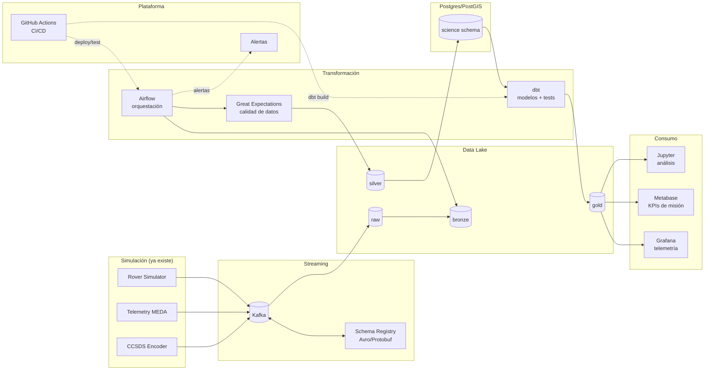
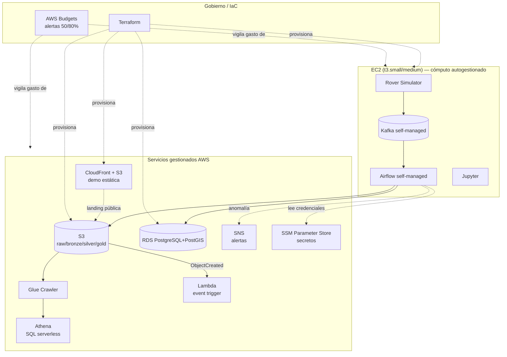

# Rover Mars — Análisis para convertirlo en un proyecto Modern Data Stack

> Análisis de solo lectura. No se modificó ningún archivo del repositorio.
> Fecha del análisis: 2026-09-03 · Actualizado: 2026-09-03 (v2 — se incorpora integración con AWS y formato ADR)

## 1. Resumen ejecutivo

`rover_mars` ya es, en su núcleo, uno de los portafolios de Data Engineering más completos que se ven en procesos de selección: simula un dominio real (Mastcam-Z / Mars 2020), tiene ingesta por streaming (Kafka), arquitectura Medallion (Bronze/Silver/Gold) sobre un data lake S3-compatible (MinIO), orquestación con Airflow (DAG de 9 tareas con dependencias reales), un modelo de datos geoespacial (PostGIS) y visualización (Grafana + Jupyter). Eso ya cubre el 60-70% de lo que se pide en una vacante de Data Engineer pleno/senior.

Lo que falta no es "más infraestructura" — es lo que separa un **prototipo Docker Compose** de un **proyecto de portafolio production-grade**: capa de transformación declarativa (dbt), calidad de datos con tests automatizados, CI/CD, Infra as Code, contratos de datos (Schema Registry), observabilidad del pipeline, una integración real con un proveedor cloud (AWS) y — muy importante para reclutadores — **una URL pública donde puedan ver el proyecto funcionando sin clonar nada**.

Esta versión del documento reorganiza esas recomendaciones como **ADRs (Architecture Decision Records)** — el formato estándar en equipos de ingeniería para dejar constancia de *qué* se decide, *por qué*, y *qué alternativas se descartaron* — e incorpora un plan concreto de integración con AWS aprovechando una cuenta real con crédito de estudiante. Cierra con una explicación en lenguaje no técnico pensada para un reclutador de Recursos Humanos (sección 10).

Este documento no propone rehacer el proyecto: propone completar el stack alrededor de lo que ya construiste, priorizado por impacto en entrevistas.

---

## 2. Fortalezas actuales (no tocar / no perder)

- **Dominio con profundidad real, no un CSV de Kaggle**: specs de la cámara Mastcam-Z, CCSDS 133.0-B-2, modelo CAHVOR, PDS4 product IDs — demuestra que puedes leer documentación técnica densa (papers NASA/JPL) y traducirla a código. Esto es lo que más te diferencia; no lo diluyas.
- **Arquitectura Medallion real**, no solo nombrada: cada capa (`raw` → `bronze` → `silver` → `gold`) tiene una transformación explícita y un motivo (validación CRC/PDS4, calibración radiométrica + geométrica, agregación por sol).
- **Streaming con Kafka + simulación de delay de luz** (3-22 min) — muestra que entiendes ingesta por eventos, no solo batch.
- **DAG de Airflow con dependencias no triviales** (`@task`, TaskGroup implícito, fan-out a `[postgis, alerts]`, timeouts, retries) — no es un "Hello World" de Airflow.
- **PostGIS con consultas espaciales reales** (`ST_MakePoint`, `ST_AsGeoJSON`) — muy pocos portafolios de DE tocan geoespacial, es un diferenciador.
- **Docker Compose completo y coherente** (healthchecks, depends_on con condiciones, red dedicada, volúmenes nombrados) — nivel de detalle por encima del promedio.
- Ya tienes experiencia de home-lab (`archi_serveur_ubuntu.md`) con Tailscale + Nginx Proxy Manager + Docker — esto es un activo para el despliegue (ver sección 8), no hace falta cloud de pago para publicarlo.
- Acceso real a una **cuenta AWS con crédito de estudiante** (no un laboratorio temporal) — permite provisionar recursos persistentes y demostrar integración cloud genuina (ver sección 6).

---

## 3. Brecha frente al "Modern Data Stack" que piden hoy

| Capa del Modern Data Stack | Qué pide el mercado (2025-2026) | Qué tienes hoy | Brecha |
|---|---|---|---|
| **Ingesta / CDC** | Kafka/Debezium, Airbyte, contratos con Schema Registry | Kafka con JSON plano, sin esquema versionado | Falta Schema Registry (Avro/Protobuf) |
| **Almacenamiento** | Data lake + warehouse columnar (Snowflake/BigQuery/Redshift/DuckDB) | MinIO (S3-compatible) + Postgres/PostGIS | Falta un warehouse analítico separado del OLTP |
| **Transformación** | **dbt** (SQL declarativo, versionado, testeable, con lineage) | Python imperativo dentro de tareas de Airflow | Es la brecha más grande y más buscada en ofertas |
| **Orquestación** | Airflow / Dagster / Prefect | Airflow 2.9, LocalExecutor | Correcto, pero falta observabilidad (SLA, alertas) |
| **Calidad de datos** | dbt tests, Great Expectations, Soda | Ninguna (solo `if tau > 2.0` embebido en Python) | Falta capa de validación declarativa |
| **CI/CD** | GitHub Actions: lint, tests, dbt build, deploy | No existe (`find` no encontró ningún workflow) | Crítico — es lo primero que mira un reclutador técnico |
| **IaC** | Terraform/Pulumi para reproducir la infra | Solo docker-compose (no versionado como IaC de nube) | Aceptable para "local-first", pero se puede envolver |
| **Cloud pública** | Experiencia demostrable con AWS/GCP/Azure | Ninguna hasta ahora | Se cierra con la sección 6 de este documento |
| **Observabilidad de datos** | Alertas de pipeline (Slack/email), métricas de freshness/volumen | `notify_science_team` solo hace `log.info` | Falta salida real de alertas |
| **Catálogo / Lineage** | dbt docs, OpenMetadata, DataHub, Glue Data Catalog | Ninguno | Bajo esfuerzo, alto impacto visual |
| **BI / Semántica** | Metabase, Superset, Looker, QuickSight | Grafana (bueno para series de tiempo, débil como BI de negocio) | Falta una capa de "dashboard de negocio" |
| **Testing de código** | pytest, cobertura, pre-commit (ruff/black/mypy) | 0 archivos de test encontrados | Crítico para credibilidad de "producción" |
| **Seguridad/Secrets** | `.env` + secret manager, sin credenciales en claro | Credenciales hardcodeadas en `docker-compose.yml` (Fernet key incluida) | Riesgo real si se publica el repo tal cual |
| **Presentación** | Demo pública, GIF/video, README con diagrama Mermaid | HTML sueltos en la raíz, sin demo desplegada | Alto impacto, bajo esfuerzo |

---

## 4. Registro de decisiones de arquitectura (ADR log)

Cada fila enlaza a un ADR detallado en las secciones 5 y 6. Estado `Propuesta` significa: analizado y recomendado en este documento, aún no implementado en el repositorio.

| ID | Título | Categoría | Prioridad | Estado |
|---|---|---|---|---|
| [ADR-001](#adr-001-adoptar-dbt-para-la-transformación-silver--gold) | Adoptar dbt para la transformación Silver → Gold | Transformación | Alta | Propuesta |
| [ADR-002](#adr-002-cicd-con-github-actions) | CI/CD con GitHub Actions | Plataforma | Alta | Propuesta |
| [ADR-003](#adr-003-suite-de-tests-unitarios-con-pytest) | Suite de tests unitarios con pytest | Calidad de código | Alta | Propuesta |
| [ADR-004](#adr-004-externalización-de-secretos-y-datos-generados-fuera-del-control-de-versiones) | Externalización de secretos y datos generados | Seguridad | Alta | Propuesta |
| [ADR-005](#adr-005-reorganización-y-presentación-profesional-del-repositorio) | Reorganización y presentación del repositorio | Presentación | Alta | Propuesta |
| [ADR-006](#adr-006-publicación-de-una-demo-pública-desplegada) | Publicación de una demo pública desplegada | Presentación | Alta | Propuesta |
| [ADR-007](#adr-007-validación-declarativa-de-calidad-de-datos) | Validación declarativa de calidad de datos | Calidad de datos | Media | Propuesta |
| [ADR-008](#adr-008-contratos-de-datos-con-schema-registry-en-kafka) | Contratos de datos con Schema Registry en Kafka | Streaming | Media | Propuesta |
| [ADR-009](#adr-009-observabilidad-y-alertado-real-del-pipeline) | Observabilidad y alertado real del pipeline | Observabilidad | Media | Propuesta |
| [ADR-010](#adr-010-capa-de-bi-de-negocio-complementaria-a-grafana) | Capa de BI de negocio complementaria a Grafana | BI | Media | Propuesta |
| [ADR-011](#adr-011-estrategia-general-de-adopción-de-aws) | Estrategia general de adopción de AWS | Cloud / Gobierno de costo | Alta | Propuesta |
| [ADR-012](#adr-012-amazon-s3-como-data-lake) | Amazon S3 como data lake | Cloud / Almacenamiento | Alta | Propuesta |
| [ADR-013](#adr-013-amazon-rds-postgresql--postgis-como-base-de-datos-gestionada) | Amazon RDS (PostgreSQL + PostGIS) gestionado | Cloud / Datos | Alta | Propuesta |
| [ADR-014](#adr-014-airflow-y-kafka-autogestionados-en-ec2-se-descartan-mwaa-y-msk) | Airflow y Kafka autogestionados en EC2 | Cloud / Cómputo | Alta | Propuesta |
| [ADR-015](#adr-015-glue-data-catalog--athena-como-capa-serverless-de-consulta) | Glue Data Catalog + Athena sobre Gold | Cloud / Analítica | Media | Propuesta |
| [ADR-016](#adr-016-automatización-event-driven-con-lambda--sns) | Automatización event-driven con Lambda + SNS | Cloud / Integración | Media | Propuesta |
| [ADR-017](#adr-017-gestión-de-secretos-con-ssm-parameter-store) | Gestión de secretos con SSM Parameter Store | Cloud / Seguridad | Alta | Propuesta |
| [ADR-018](#adr-018-publicación-de-la-demo-estática-con-s3--cloudfront) | Publicación de demo estática con S3 + CloudFront | Cloud / Presentación | Alta | Propuesta |
| [ADR-019](#adr-019-terraform-como-iac-para-los-recursos-aws) | Terraform como IaC para recursos AWS | Cloud / IaC | Media | Propuesta |
| [ADR-020](#adr-020-aws-budgets-como-guardrail-de-gasto) | AWS Budgets como guardrail de gasto | Cloud / FinOps | Alta | Propuesta |

---

## 5. ADRs — Núcleo Modern Data Stack

#### ADR-001: Adoptar dbt para la transformación Silver → Gold
**Contexto:** la lógica de calibración y agregación (`radiometric_calibration`, `build_gold_aggregates`) vive como funciones Python imperativas dentro de tareas de Airflow; no es versionable como SQL declarativo ni testeable de forma estándar, y dbt es la tecnología de transformación más solicitada en ofertas de Data Engineer actuales.
**Decisión:** crear un proyecto `dbt/` sobre el esquema `science` de Postgres, con modelos `stg_image_products`, `int_radiometric_calibration`, `fct_sol_filter_coverage`, `dim_dsn_stations`, tests declarativos (`not_null`, `accepted_values`, `relationships`), y ejecutar `dbt run`/`dbt test` como tarea dentro del DAG existente.
**Consecuencias:** ✅ transformación versionada, testeable y documentada automáticamente (`dbt docs`), con lineage visual gratuito. ⚠️ hay que decidir qué lógica permanece en Airflow (orquestación/streaming) y cuál se traslada a SQL (agregación/transformación).
**Alternativas consideradas:** mantener todo en Python dentro de Airflow (statu quo, pero es la brecha más señalada por reclutadores); SQLMesh (alternativa más nueva, aún poco reconocida en ofertas).

#### ADR-002: CI/CD con GitHub Actions
**Contexto:** no existe ningún workflow de CI; un evaluador técnico suele revisar la pestaña Actions antes que el código.
**Decisión:** añadir `lint.yml` (ruff/black), `test.yml` (pytest), `dbt-ci.yml` (`dbt build` contra Postgres efímero) y `docker-build.yml` (build de imágenes) como workflows en cada PR/push a `main`.
**Consecuencias:** ✅ evidencia objetiva de validación automática; badges de estado en el README. ⚠️ mantenimiento continuo de los workflows a medida que el proyecto crece.
**Alternativas consideradas:** GitLab CI/Jenkins — descartadas porque el repositorio ya vive en GitHub y Actions es la opción de menor fricción.

#### ADR-003: Suite de tests unitarios con pytest
**Contexto:** 0 archivos de test en un proyecto con matemática no trivial (CRC-16, fórmula I/F, modelo CAHVOR, modelo MEDA).
**Decisión:** crear `tests/` con pytest cubriendo el encoder CCSDS, la fórmula de calibración radiométrica I/F, y los rangos físicos del generador de telemetría.
**Consecuencias:** ✅ prueba directa de calidad de software más allá de "el pipeline corre"; base para `test.yml` (ADR-002). ⚠️ esfuerzo inicial de escribir fixtures, mitigado porque la lógica ya existe y es mayormente pura (poco I/O).
**Alternativas consideradas:** solo tests de integración end-to-end vía Docker — más lentos, más frágiles, peor señal de diseño de software.

#### ADR-004: Externalización de secretos y datos generados fuera del control de versiones
**Contexto:** `docker-compose.yml` contiene credenciales en texto plano (incluida la Fernet key de Airflow) y el `.gitignore` es una plantilla de .NET que no cubre `__pycache__`, `.venv`, `.env` ni los datos generados en `data/*`.
**Decisión:** mover todas las credenciales a un `.env` (con `.env.example` documentado) excluido de git, y reescribir `.gitignore` para el stack real.
**Consecuencias:** ✅ elimina un riesgo de seguridad real si el repo se hace público; repo más liviano. ⚠️ si el repo ya es público, cualquier credencial expuesta en el historial de git debería rotarse.
**Alternativas consideradas:** dejarlo como está (inaceptable para un repo público); usar un gestor de secretos desde el día uno en local (sobre-ingeniería; se reserva para el despliegue cloud vía ADR-017).

#### ADR-005: Reorganización y presentación profesional del repositorio
**Contexto:** la raíz mezcla código de producción con archivos de exploración (`donne1.html`, `index1.html`, `infra1.html`, `infra2fr.html`, `poc.md`) y carece de `LICENSE`; es la primera impresión que recibe un reclutador.
**Decisión:** mover los archivos de exploración a `docs/drafts/` (o eliminarlos si ya no aportan), dejar en la raíz solo lo esencial, añadir `LICENSE` (MIT), y adoptar diagramas Mermaid (en vez de ASCII) como estándar de documentación en el README.
**Consecuencias:** ✅ primera impresión de "proyecto terminado"; diagramas renderizados nativamente en GitHub/LinkedIn preview. ⚠️ ninguna relevante — es prácticamente solo limpieza.
**Alternativas consideradas:** dejar los archivos donde están confiando en que no se noten — riesgo innecesario y evitable.

#### ADR-006: Publicación de una demo pública desplegada
**Contexto:** un reclutador no va a clonar el repo y levantar diez contenedores para evaluar el proyecto.
**Decisión:** publicar `dashboard/index.html` como landing pública siempre disponible (variante AWS en ADR-018) y dejar el stack completo accesible bajo demanda para profundizar en vivo.
**Consecuencias:** ✅ convierte el proyecto de "código que dice que funciona" a "esto funciona, mira"; reduce fricción de evaluación a un clic. ⚠️ exige mantener al menos un punto de entrada siempre disponible.
**Alternativas consideradas:** solo GIF/video sin demo viva — más barato pero menos convincente en una entrevista técnica en vivo.

#### ADR-007: Validación declarativa de calidad de datos
**Contexto:** la única validación hoy es un `if tau > 2.0` embebido en Python dentro de `anomaly_detection`, sin capa de reglas declarativas ni reporte estandarizado.
**Decisión:** incorporar Great Expectations (o Soda Core) para validar tamaño de imagen, presencia del label PDS4, y rangos físicos de telemetría, como tarea `data_quality_gate` antes de `write_silver_layer`.
**Consecuencias:** ✅ refuerza el patrón "no dejar pasar datos malos a Silver/Gold" que el proyecto ya insinúa; reportes reutilizables como evidencia en entrevistas. ⚠️ se solapa parcialmente con dbt tests (ADR-001); hay que definir el límite entre ambas.
**Alternativas consideradas:** dejar toda la validación en dbt tests — cubre menos casos no-SQL (metadatos de archivo, objetos del lake).

#### ADR-008: Contratos de datos con Schema Registry en Kafka
**Contexto:** los tópicos (`mastcamz.raw.images`, `mastcamz.telemetry`, `mastcamz.ccsds.packets`) transportan JSON sin esquema versionado, lo que no refleja un contrato de datos real.
**Decisión:** añadir Confluent Schema Registry con esquemas Avro (o Protobuf) para los tópicos principales.
**Consecuencias:** ✅ demuestra entendimiento de contratos de datos en streaming, tema creciente en ofertas; encaja con que el proyecto ya simula un protocolo binario real (CCSDS). ⚠️ requiere migrar productores/consumidores de JSON a Avro.
**Alternativas consideradas:** mantener JSON con validación manual en el código — más simple, pero no demuestra la herramienta que el mercado espera ver.

#### ADR-009: Observabilidad y alertado real del pipeline
**Contexto:** la tarea `notify_science_team` solo escribe en el log (`log.info`), sin salida real de alertas.
**Decisión:** conectar alertas reales (SNS en el despliegue AWS — ADR-016 —, o webhook Slack/Discord en el despliegue self-hosted) cuando `anomaly_detection` detecta tormenta de polvo o batería baja.
**Consecuencias:** ✅ demo mucho más convincente en vivo; poco código adicional sobre lo que ya existe. ⚠️ depende de tener un canal de notificación configurado en cada entorno.
**Alternativas consideradas:** dejarlo solo en logs — statu quo, insuficiente como demostración.

#### ADR-010: Capa de BI de negocio complementaria a Grafana
**Contexto:** Grafana es adecuado para series de tiempo tipo infraestructura, pero un perfil de negocio espera un dashboard de "KPIs de la misión" (imágenes por sol, cobertura por filtro, eventos de polvo), no un panel de monitoreo técnico.
**Decisión:** añadir Metabase (self-host) o, en el despliegue AWS, evaluar Athena + QuickSight de forma puntual (ver ADR-015 y la nota de costo en ADR-020), apuntando a los modelos dbt marcados como expuestos.
**Consecuencias:** ✅ dashboard legible para audiencias no técnicas (reutilizable en la sección 10); reutiliza los modelos de ADR-001. ⚠️ un servicio más que mantener corriendo.
**Alternativas consideradas:** forzar a Grafana a cumplir ambos roles (peor experiencia para KPIs de negocio); Superset (válida, Metabase se prioriza por menor curva de configuración).

---

## 6. ADRs — Integración con AWS (cuenta con crédito de estudiante)

Contexto común a todos los ADRs de esta sección: se dispone de una **cuenta AWS real** (no un laboratorio temporal), con IAM completo y crédito de estudiante limitado (~100-200 USD, no repuesto automáticamente). El objetivo es maximizar la señal técnica frente a un entrevistador por cada dólar de crédito gastado, evitando quedarse sin presupuesto para mantener la demo disponible.

#### ADR-011: Estrategia general de adopción de AWS
**Contexto:** ir "100% managed" (MWAA + MSK + Redshift + QuickSight always-on) agotaría el crédito en semanas; ir "100% self-hosted" pierde la señal de "sé usar AWS" que se busca demostrar.
**Decisión:** modelo híbrido — el cómputo con estado y de larga duración (Airflow, Kafka, Jupyter) permanece autogestionado en una única instancia EC2; los servicios administrados de AWS se adoptan selectivamente donde el costo marginal es bajo y la señal para un entrevistador es alta (S3, RDS free tier, Glue+Athena, Lambda, SNS, SSM, CloudFront). Cuando se descarta un servicio "enterprise" (MSK, MWAA, QuickSight always-on), la decisión y su motivo quedan documentados explícitamente.
**Consecuencias:** ✅ costo total controlado; narrativa de "criterio de ingeniería" en vez de "usé todo lo que había". ⚠️ el stack conserva un componente self-managed, es decir, no es "cloud-native puro" — se compensa siendo explícito sobre el porqué.
**Alternativas consideradas:** 100% managed (rechazada por costo); 100% self-hosted en el servidor propio (rechazada porque no demuestra uso real de AWS).

#### ADR-012: Amazon S3 como data lake
**Contexto:** MinIO cumple bien localmente y es API-compatible con S3, que es el servicio de mayor reconocimiento de mercado para esta función y de costo casi nulo en este volumen.
**Decisión:** crear buckets `rovermars-raw`, `-bronze`, `-silver`, `-gold` en S3; el código de simulador/ingestión usa boto3 (o el mismo cliente compatible con S3) parametrizado por variable de entorno, para alternar local/cloud sin reescribir lógica de negocio.
**Consecuencias:** ✅ free tier (5 GB) cubre meses de demo; servicio con máximo reconocimiento en ofertas. ⚠️ requiere gestionar políticas IAM de bucket con cuidado para no exponer datos por error.
**Alternativas consideradas:** mantener solo MinIO (pierde la señal de AWS real); Azure Blob/GCS (el crédito disponible es específicamente de AWS).

#### ADR-013: Amazon RDS (PostgreSQL + PostGIS) como base de datos gestionada
**Contexto:** hoy Postgres/PostGIS corre en un contenedor Docker sin backups gestionados ni alta disponibilidad.
**Decisión:** migrar a una instancia RDS `db.t3.micro` con extensión PostGIS habilitada, dentro del free tier de 12 meses (750 h/mes, 20 GB).
**Consecuencias:** ✅ backups automáticos y parcheo gestionado; señal de "sé operar bases de datos gestionadas". ⚠️ fuera del free tier (mes 13+) tiene costo recurrente — decidir si se apaga/snapshotea cuando no hay demo activa.
**Alternativas consideradas:** Aurora PostgreSQL Serverless v2 (más caro, no justificado por el volumen); mantener Postgres en el mismo EC2 (más barato pero pierde la señal de "managed DB").

#### ADR-014: Airflow y Kafka autogestionados en EC2 (se descartan MWAA y MSK)
**Contexto:** Amazon MWAA (Airflow gestionado) parte en ~300+ USD/mes fijos y Amazon MSK (Kafka gestionado) ronda ~150+ USD/mes incluso con el clúster más pequeño; ambos agotarían el crédito de estudiante en semanas sin aportar señal adicional relevante frente a tener Airflow/Kafka ya funcionando en Docker.
**Decisión:** mantener Airflow (LocalExecutor) y Kafka corriendo vía el mismo `docker-compose` actual, sobre una única instancia EC2 (`t3.small` o `t3.medium`), apagable cuando no hay demo activa.
**Consecuencias:** ✅ costo controlado (~15-30 USD/mes según tamaño de instancia); reutiliza el docker-compose existente casi sin cambios. ⚠️ no demuestra experiencia directa con los servicios gestionados equivalentes — se compensa documentando el trade-off, lo cual es en sí una señal de criterio senior.
**Alternativas consideradas:** MWAA + MSK (rechazadas por costo); Amazon Kinesis Data Streams como alternativa más económica a Kafka gestionado (~11-15 USD/mes por shard) — se deja anotada como posible ADR futuro si el crédito lo permite, no se descarta por completo.

#### ADR-015: Glue Data Catalog + Athena como capa serverless de consulta
**Contexto:** falta una capa de "warehouse analítico" separada del OLTP; construir un warehouse dedicado (Redshift) es costoso para el volumen de datos de un portafolio.
**Decisión:** publicar la capa Gold en S3 como Parquet particionado por `sol`, catalogarlo con un Glue Crawler, y exponerlo para consulta SQL serverless vía Athena.
**Consecuencias:** ✅ prácticamente gratis (Athena cobra por TB escaneado — céntimos en este volumen; Glue Crawler céntimos por ejecución); patrón "lakehouse" muy demandado; conecta directo con BI (ADR-010). ⚠️ añade Parquet al pipeline — hay que ampliar `build_gold_aggregates` para escribir Parquet además de/en vez de JSON.
**Alternativas consideradas:** Amazon Redshift Serverless (más caro, no justificado por el volumen); mantener Gold solo como JSON en S3 (pierde la capa de catálogo/consulta SQL).

#### ADR-016: Automatización event-driven con Lambda + SNS
**Contexto:** hoy la ingesta y las alertas son puramente internas al DAG (`log.info`), sin reacción a eventos externos ni salida real de notificaciones.
**Decisión:** (a) disparar una función Lambda ante `ObjectCreated` en el bucket `raw` para validación ligera; (b) publicar en un tópico SNS (email) cuando `anomaly_detection` detecta tormenta de polvo o batería baja.
**Consecuencias:** ✅ patrón event-driven nativo de AWS, muy pedido; alertas reales entregables en una demo en vivo; ambos dentro de free tier para este volumen (Lambda 1M requests/mes, SNS 1000 emails/mes). ⚠️ dos servicios más a mantener y documentar.
**Alternativas consideradas:** webhook a Slack/Discord (más simple pero sin señal de AWS); Amazon EventBridge en vez de disparo directo S3→Lambda (más "enterprise", se deja como extensión futura).

#### ADR-017: Gestión de secretos con SSM Parameter Store
**Contexto:** las credenciales (Postgres, S3, Fernet key de Airflow) están hoy hardcodeadas en `docker-compose.yml` (ver ADR-004 para la variante local).
**Decisión:** mover todas las credenciales/API keys a AWS Systems Manager Parameter Store (tier estándar, gratis), leídas por los contenedores al arranque vía un rol IAM asignado a la instancia EC2.
**Consecuencias:** ✅ gratis; resuelve en su variante cloud el hallazgo de seguridad de ADR-004; demuestra buenas prácticas de gestión de secretos. ⚠️ requiere un rol IAM con permisos acotados de lectura — superficie de permisos a gestionar con cuidado.
**Alternativas consideradas:** AWS Secrets Manager (rotación automática, pero ~0.40 USD/secreto/mes — no se justifica en este volumen); mantener solo `.env` local (insuficiente como demostración de manejo de secretos en la nube).

#### ADR-018: Publicación de la demo estática con S3 + CloudFront
**Contexto:** se necesita una URL pública, siempre disponible y de costo casi nulo, que no dependa de que el EC2 de la demo esté encendido.
**Decisión:** publicar `dashboard/index.html` como sitio estático en S3 con distribución CloudFront (HTTPS, cache, dominio propio opcional).
**Consecuencias:** ✅ costo de centavos al mes; siempre disponible; coherente con contar la historia de "todo el stack vive en AWS" de punta a punta (cómputo, datos, entrega de contenido). ⚠️ una capa más de infraestructura a provisionar, mitigada por ADR-019 (Terraform).
**Alternativas consideradas:** GitHub Pages/Vercel (gratis y más simple, pero no suma a la narrativa de integración AWS end-to-end).

#### ADR-019: Terraform como IaC para los recursos AWS
**Contexto:** hasta ahora toda la infraestructura se define solo vía `docker-compose.yml`, válido para local/EC2 pero no reproducible como recursos nativos de AWS (buckets, IAM, RDS, red).
**Decisión:** crear un módulo `infra/aws/` en Terraform que provisione S3, RDS, el EC2 con su Security Group, roles IAM, el bucket+distribución CloudFront, los parámetros SSM y la alarma de AWS Budgets (ADR-020), documentado en el README con `terraform plan`/`apply`.
**Consecuencias:** ✅ cierra el gap de IaC del análisis general; "Terraform + AWS" es una combinación explícitamente buscada en ofertas de Data/Platform Engineer; reproducible y destruible (`terraform destroy`) para ahorrar crédito cuando no hay demo activa. ⚠️ curva de aprendizaje adicional si Terraform aún no se domina — mitigable empezando con un módulo pequeño (S3 + RDS) y creciendo por fases.
**Alternativas consideradas:** Pulumi (menos adoptado en ofertas que Terraform); CloudFormation/CDK (más atado al ecosistema AWS, menos transferible si en el futuro se busca ese diferencial multi-nube).

#### ADR-020: AWS Budgets como guardrail de gasto
**Contexto:** el crédito de estudiante es finito (~100-200 USD) y no repuesto automáticamente; un error de configuración (ej. dejar RDS o EC2 corriendo, tráfico inesperado en un bucket) puede agotarlo sin aviso.
**Decisión:** configurar AWS Budgets con alertas por email al 50% y 80% del crédito disponible, y revisar Cost Explorer semanalmente mientras la demo esté activa.
**Consecuencias:** ✅ previene sorpresas; es en sí misma una señal de madurez ("entiendo FinOps básico") muy valorada; gratis. ⚠️ requiere disciplina de revisión manual — no hay corte automático de recursos salvo que se configure explícitamente (posible extensión vía Budget Actions + Lambda).
**Alternativas consideradas:** no poner límites y confiar solo en revisión manual (riesgo de sorpresa); usar Budget Actions para detener recursos automáticamente al superar el umbral (más robusto, se deja como extensión de esta ADR si el tiempo lo permite).

---

## 7. Arquitectura objetivo

### 7.1 Visión general (agnóstica de proveedor)

### 7.2 Variante de despliegue en AWS (ADR-011 a ADR-020)

---

## 8. Cómo desplegarlo para que sea una demo real

**Opción A — Self-host en tu servidor Ubuntu (costo casi cero)**
Desplegar `rover_mars` en tu servidor con Docker + Nginx Proxy Manager + Tailscale (ver `archi_serveur_ubuntu.md`), exponiendo solo lo necesario vía subdominios con TLS, y protegiendo Airflow/MinIO con auth adicional o dejándolos accesibles solo por Tailscale. Requiere primero aplicar ADR-004 (quitar credenciales por defecto).

**Opción B — Demo "lite" en cloud gestionado sin servidor propio**
Un VM pequeña dedicada solo a demo (Hetzner/Oracle free tier) o el `dashboard/index.html` como página estática (GitHub Pages/Vercel) — gratis, siempre disponible, cero mantenimiento.

**Opción C — AWS con crédito de estudiante (recomendada como complemento, no reemplazo)**
Aplicar ADR-011 a ADR-020: EC2 para Airflow/Kafka, S3 como lake, RDS como base de datos, Glue+Athena como capa analítica serverless, y CloudFront+S3 para la landing pública. Es la opción que más explícitamente responde al filtro "experiencia con AWS" que muchas ofertas piden como requisito duro, y el trabajo de documentarla como ADRs (sección 6) es en sí mismo un artefacto de portafolio.

**Recomendación práctica:** combinar B (landing estática siempre gratis y arriba) con C (stack funcional en AWS, encendido bajo demanda o durante ventanas de entrevista para controlar el gasto del crédito vía ADR-020), dejando A como respaldo si el crédito de AWS se agota antes de conseguir empleo.

---

## 9. Cómo comunicarlo a reclutadores técnicos

- **README como landing page**, no como manual de instalación: primero "qué resuelve y por qué es difícil", después el diagrama, y solo al final los pasos de instalación.
- Sección explícita **"Qué de este proyecto mapea a un rol de Data Engineer real"**, incluyendo ahora explícitamente AWS: Medallion architecture → data lake design; Airflow → orquestación productiva; PostGIS → geoespacial; Kafka → streaming; dbt → transformación versionada y testeable; S3/RDS/Glue/Lambda/Terraform → integración cloud real con criterio de costo.
- Badges de estado (build passing, dbt tests, licencia) en la cabecera del README.
- Un GIF de 20-30s del pipeline corriendo (Airflow UI + Grafana actualizándose) vale más que cualquier párrafo.
- Enlazar este documento (o un resumen de la sección 6) como evidencia de que las decisiones de arquitectura están razonadas, no improvisadas — los ADRs son, en sí mismos, una pieza de portafolio que muy pocos candidatos entregan.

---

## 10. Explicación para perfiles no técnicos (por ejemplo, un reclutador de RRHH)

**¿Qué es este proyecto, en una frase?**
Es una réplica funcional, construida desde cero, del sistema que la NASA usa para recibir las fotos y los datos ambientales que envía el rover Perseverance desde Marte, procesarlos automáticamente, verificar que no lleguen dañados, corregirlos técnicamente, y dejarlos listos para que un científico los use — todo corriendo de extremo a extremo, no solo en teoría.

**¿Por qué es difícil, y por qué eso importa?**
No es un ejercicio de curso con datos de ejemplo. Javier tuvo que leer documentación técnica real de la NASA (especificaciones de cámara, protocolos de comunicación espacial, modelos de calibración de imágenes) y traducirla en un sistema de software que funciona solo, sin supervisión manual. Esa capacidad — entender un problema complejo del mundo real y construir la infraestructura de datos que lo resuelve — es exactamente lo que una empresa necesita de un Data Engineer: no es un curso de certificación, es la simulación de un problema real de negocio.

**Puntos fuertes que un reclutador puede reconocer sin ser técnico:**
- **Procesa información que llega constantemente**, como lo hace un sistema bancario, de e-commerce o de sensores IoT — no datos estáticos que ya vienen limpios.
- **Organiza los datos en niveles de confianza crecientes** (dato crudo → validado → corregido → listo para negocio), el mismo patrón que usan empresas como Netflix, Uber o cualquier banco moderno para garantizar que las decisiones se tomen sobre datos confiables.
- **Automatiza todo el proceso**, con reintentos automáticos si algo falla — es decir, el sistema es responsable de su propia salud, no depende de que alguien lo revise manualmente.
- **Detecta problemas por sí solo** (por ejemplo, una "tormenta de polvo" simulada o batería baja) y puede avisar automáticamente — el mismo principio que usa cualquier sistema de monitoreo de una empresa real.
- **Puede desplegarse en la nube (Amazon Web Services)**, igual que lo haría una empresa real, y además demuestra criterio de presupuesto: en vez de usar todo lo disponible, elige qué usar según el costo — una señal de madurez que las empresas valoran especialmente en un candidato junior/pleno.

**¿Qué tan cerca está de un "despliegue profesional" real?**
Hoy el proyecto ya funciona de punta a punta en un entorno de pruebas (similar a como una empresa prueba internamente antes de lanzar). Lo que falta para parecerse a un sistema en producción real de una empresa es: (1) pruebas automáticas que verifiquen que nada se rompe antes de publicar cambios, (2) un lugar público donde cualquiera pueda verlo funcionando sin instalar nada, y (3) mover parte del sistema a la nube de Amazon de forma permanente. Estos tres puntos están documentados en este mismo informe (secciones 4, 6 y 8) y son alcanzables en unas pocas semanas de trabajo — no son un rediseño, son el último tramo antes de la meta.

**En una frase para compartir:** *"Construyó y documentó, con el mismo estándar que usaría un equipo de ingeniería profesional, una réplica end-to-end del pipeline de datos de una misión real de la NASA — y sabe explicar, con criterio de costo y arquitectura, cómo lo llevaría a producción."*

---

## 11. Roadmap sugerido (por fases)

**Fase 1 (1 semana) — Higiene y confianza**
ADR-004 (secretos y `.gitignore`) → ADR-005 (limpieza de raíz, `LICENSE`, diagramas Mermaid).

**Fase 2 (1-2 semanas) — Calidad de ingeniería**
ADR-003 (tests unitarios) → ADR-002 (GitHub Actions) → `Makefile`.

**Fase 3 (1-2 semanas) — El diferenciador: dbt**
ADR-001 (proyecto dbt, tests, docs, integración con el DAG).

**Fase 4 (1-2 semanas) — Integración AWS**
ADR-020 (Budgets primero, como guardrail) → ADR-012 (S3) → ADR-013 (RDS) → ADR-017 (SSM) → ADR-014 (EC2 para Airflow/Kafka) → ADR-019 (Terraform, retroactivo sobre lo ya creado a mano si hace falta) → ADR-015/016/018 según tiempo disponible.

**Fase 5 (1 semana) — Despliegue y presentación**
ADR-006 (demo pública) combinando servidor propio y AWS (sección 8, Opción C) + GIF de demo en el README + sección 10 adaptada como resumen ejecutivo en el propio README.

**Fase 6 (opcional, según tiempo) — Pulido final**
ADR-007 (Great Expectations), ADR-008 (Schema Registry), ADR-009/ADR-010 (alertas y BI de negocio).

Con las Fases 1-5 ya se tiene un proyecto que responde de forma sólida tanto a "cuéntame de un proyecto de datos end-to-end que hayas construido" en una entrevista técnica, como a "muéstrame algo" en una primera llamada con Recursos Humanos.
