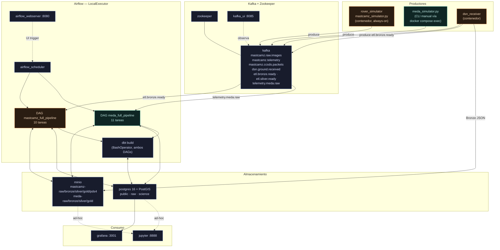
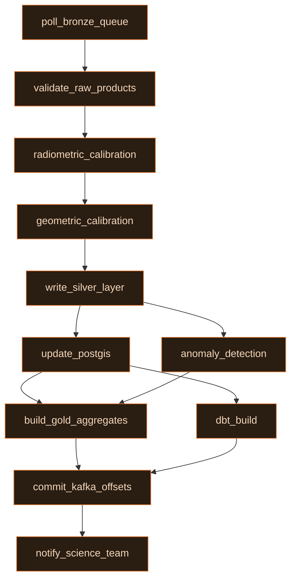
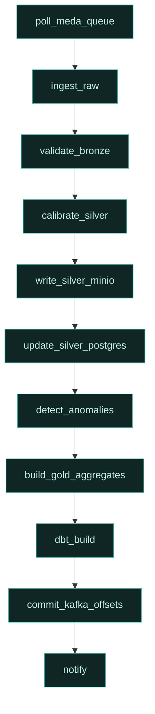
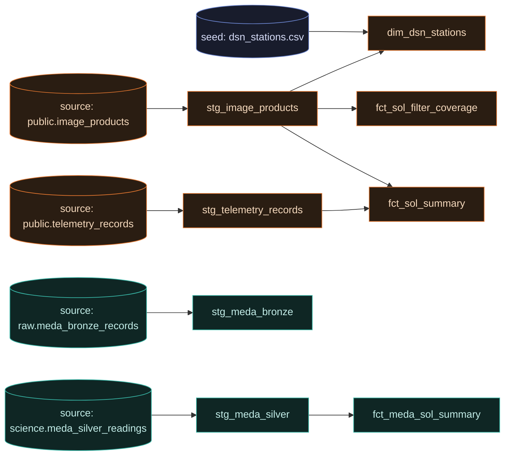

# Infraestructura — cómo está conectada y sus dependencias

> Generado a partir de `docker-compose.yml`, `airflow/dags/*.py`, `database/*.sql`,
> `dbt/models/**`, `dbt/models/staging/_staging__sources.yml` y
> `specs/001-meda-pipeline/quickstart.md`. Fecha: 2026-09-30.
> Versión interactiva (con leyenda de color y tablas): [artefacto publicado](https://claude.ai/artifact/TV5tCL6dEiovzc6Q2xuVfG).

Dos pipelines de telemetría (**Mastcam-Z** y **MEDA**) comparten el mismo stack
de contenedores: 13 servicios Docker, 7 tópicos Kafka, 9 buckets MinIO/S3,
3 schemas Postgres y 8 modelos dbt.

---

## 1. Topología de infraestructura

Todo vive en la red Docker `rover_net`. Las flechas sólidas son dependencias de
datos reales (quién escribe/lee qué); las punteadas son acceso de solo lectura
ad-hoc que no bloquea el arranque de nada.

**Nota:** `rover_simulator` corre siempre encendido y genera datos Mastcam-Z;
`meda_simulator.py` vive en el mismo contenedor pero se ejecuta manualmente con
`docker compose exec rover_simulator python meda_simulator.py ...` — no tiene
schedule propio (ver `specs/001-meda-pipeline/quickstart.md`).

---

## 2. Grafo de tareas de cada DAG

Ambos DAG siguen el mismo patrón (Fase 7 de
`docs/GUIA_IMPLEMENTACION_MODERN_DATA_STACK.md`): el commit de offsets de Kafka
se difiere hasta el final, después de que Gold y dbt confirman éxito — así un
fallo a mitad de camino no pierde mensajes, porque el reproceso es idempotente.

### `mastcamz_full_pipeline` (cron `*/15 * * * *`)

### `meda_full_pipeline` (manual, `schedule_interval=None`)

| DAG | Trigger | Tabla Bronze | Tabla Silver | Quarantine |
|---|---|---|---|---|
| `mastcamz_full_pipeline` | cron `*/15 * * * *` | — (Bronze vive en MinIO, no en Postgres) | `public.image_products` | No aplica |
| `meda_full_pipeline` | manual (`schedule_interval=None`) | `raw.meda_bronze_records` | `science.meda_silver_readings` | `quarantine_reason`: `crc_mismatch` · `unknown_apid` · `payload_too_large` · `missing_fields` |

---

## 3. Linaje de modelos dbt

Cuatro fuentes, cuatro modelos de staging, un seed estático y cuatro marts.
`stg_meda_bronze` existe y pasa sus tests, pero hoy ningún mart lo referencia
todavía — es una hoja suelta en el grafo, no un error.

---

## Hallazgo corregido

`specs/001-meda-pipeline/quickstart.md` usaba nombres de servicio que no
existían en `docker-compose.yml` (`simulator` en vez de `rover_simulator`,
`airflow-scheduler`/`airflow-worker` en vez de `airflow_scheduler`, y un
comando `mc` ejecutado dentro del contenedor `minio`, que solo trae el
servidor, no el cliente). Ya se corrigió directamente en ese archivo.
