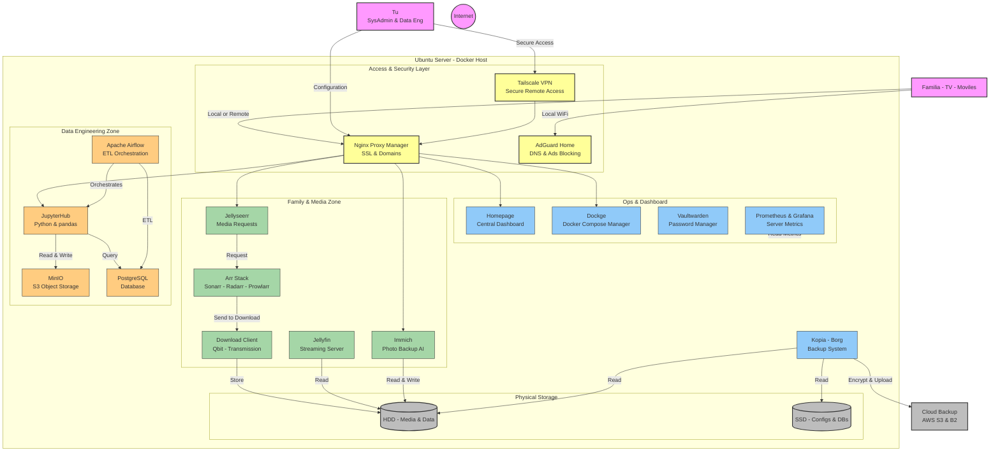

```mermaid
graph TD
    %% Estilos de Nodos
    classDef external fill:#f9f,stroke:#333,stroke-width:2px;
    classDef entry fill:#ff9,stroke:#333,stroke-width:2px;
    classDef sysadmin fill:#90caf9,stroke:#333,stroke-width:1px;
    classDef media fill:#a5d6a7,stroke:#333,stroke-width:1px;
    classDef data fill:#ffcc80,stroke:#333,stroke-width:1px;
    classDef storage fill:#bdbdbd,stroke:#333,stroke-width:2px;

    %% Nodos Externos
    UserFamily[Familia - TV - Moviles]:::external
    UserAdmin[Tu<br/>SysAdmin & Data Eng]:::external
    Internet((Internet)):::external
    CloudBackup[Cloud Backup<br/>AWS S3 & B2]:::storage

    %% El Servidor Ubuntu
    subgraph Ubuntu_Server [Ubuntu Server - Docker Host]
        direction TB

        %% Capa de Entrada
        subgraph Access_Layer [Access & Security Layer]
            Tailscale[Tailscale VPN<br/>Secure Remote Access]:::entry
            NPM[Nginx Proxy Manager<br/>SSL & Domains]:::entry
            AdGuard[AdGuard Home<br/>DNS & Ads Blocking]:::entry
        end

        %% Capa de Gestion
        subgraph SysAdmin_Ops [Ops & Dashboard]
            Homepage[Homepage<br/>Central Dashboard]:::sysadmin
            Dockge[Dockge<br/>Docker Compose Manager]:::sysadmin
            Vaultwarden[Vaultwarden<br/>Password Manager]:::sysadmin
            Monitoring[Prometheus & Grafana<br/>Server Metrics]:::sysadmin
        end

        %% Stack Multimedia
        subgraph Media_Stack [Family & Media Zone]
            Jellyseerr[Jellyseerr<br/>Media Requests]:::media
            Jellyfin[Jellyfin<br/>Streaming Server]:::media
            Immich[Immich<br/>Photo Backup AI]:::media
            ArrStack[Arr Stack<br/>Sonarr - Radarr - Prowlarr]:::media
            Downloader[Download Client<br/>Qbit - Transmission]:::media
        end

        %% Stack Datos
        subgraph Data_Eng [Data Engineering Zone]
            Jupyter[JupyterHub<br/>Python & pandas]:::data
            Airflow[Apache Airflow<br/>ETL Orchestration]:::data
            MinIO[MinIO<br/>S3 Object Storage]:::data
            Postgres[PostgreSQL<br/>Database]:::data
        end

        %% Almacenamiento Local
        subgraph Storage_Layer [Physical Storage]
            HDD_Media[(HDD - Media & Data)]:::storage
            SSD_Docker[(SSD - Configs & DBs)]:::storage
        end

        %% Backup
        Kopia[Kopia - Borg<br/>Backup System]:::sysadmin
    end

    %% Conexiones
    UserFamily -->|Local WiFi| AdGuard
    UserFamily -->|Local or Remote| NPM
    UserAdmin -->|Secure Access| Tailscale
    UserAdmin -->|Configuration| NPM

    Tailscale --> NPM
    NPM --> Homepage
    NPM --> Jellyseerr
    NPM --> Immich
    NPM --> Jupyter
    NPM --> Dockge

    %% Flujo Multimedia
    Jellyseerr -->|Request| ArrStack
    ArrStack -->|Send to Download| Downloader
    Downloader -->|Store| HDD_Media
    Jellyfin -->|Read| HDD_Media
    Immich -->|Read & Write| HDD_Media

    %% Flujo Datos
    Jupyter -->|Read & Write| MinIO
    Jupyter -->|Query| Postgres
    Airflow -->|Orchestrates| Jupyter
    Airflow -->|ETL| Postgres

    %% Monitorizacion
    Monitoring -.->|Read Metrics| Ubuntu_Server

    %% Backup
    Kopia -->|Read| HDD_Media
    Kopia -->|Read| SSD_Docker
    Kopia -->|Encrypt & Upload| CloudBackup
```